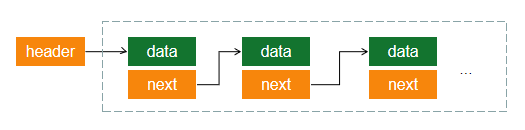
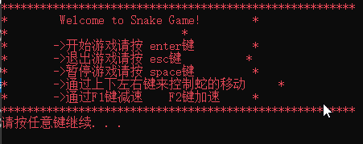

# 贪吃蛇小游戏

## 游戏概览

有关C语言的一些基础知识和运行环境问题可以参考我的博文[《C语言中的核心知识点》](http://dp2px.com/2019/03/21/cpp1/)

```null
*******************************************************
*        Welcome to Snake Game!        *
*                                      *
*       ->开始游戏请按 enter键          *
*       ->退出游戏请按 esc键            *
*       ->暂停游戏请按 space键           *
*       ->通过上下左右键来控制蛇的移动    *
*       ->通过F1键减速    F2键加速       *
*******************************************************
请按任意键继续. . .
```

按enter进入游戏

```null
■■■■■■■■■■■■■■■■■■
■                ■     当前分数/通关分0/10
■                ■     当前分每步得分:1
■                ■
■                ■     速度越快 得分越高哦！！
■       ***      ■
■                ■
■                ■
■        #       ■
■■■■■■■■■■■■■■■■■■
```

<!-- more -->

## 预备知识

### 等待输入

`system()`函数属于stdlib标准库，这个库中定义了一些宏和通用的工具函数。

`system("pause")`就是从程序里调用“pause”命令，而“pause”这个系统命令的功能很简单，就是在命令行上输出一行类似于“Press any   key to exit”或“请按任意键继续\.\.\.”的字，等待用户按一个键，然后返回。

### 设置光标位置

编写Windows程序，要包含 windows.h 头文件。windows.h 还包含了其他一些Windows头文件，例如：

- windef.h：基本类型定义
- winbase.h：内核函数
- wingdi.h：用户接口函数
- winuser.h： 图形设备接口函数

这些头文件定义了Windows的所有数据类型、函数原型、数据结构和符号常量，也就是说，所有的Windows API都在这些头文件中声明。

设置光标位置就是用到了windows.h头文件中的SetConsoleCursorPosition函数。

```cpp
BOOL WINAPI SetConsoleCursorPosition(
  _In_ HANDLE hConsoleOutput,
  _In_ COORD  dwCursorPosition
);
```

其中COORD是一个结构体，用来定义屏幕的坐标。如下：

```cpp
typedef struct _COORD {
  SHORT X;
  SHORT Y;
} COORD, *PCOORD;
```

HANDLE是一个句柄，用来标识不同设备的数值，GetStdHandle函数可以从一个特定的标准设备（标准输入、标准输出或标准错误）中取得一个句柄。

### 链表实现

链表是存储数据的一种结构。



header为这个链表的头指针，第一个数据结点为头结点，有的链表实现头结点不存放有效数据，而是从下一个结点开始存放有效数据，这样做可以方便操作链表。

结点定义：

```cpp
struct Node{
    int data;
    struct Node *pNext;
}
```

创建多个结点：

```cpp
//首先创建头结点并让header指向它
header = (pSnake)malloc(sizeof(Snake));
header->next = NULL;
//创建临时指针（表示目前的最后一个结点）
pSnake cur = head;  
for(int i = 0; i < 3; i++){
    //给第 i+1 个节点分配内存空间
    struct Node *pNew = (struct Node *)malloc(sizeof(struct Node));
    if(NULL == pNew){
        exit(-1);
    }
    cur->next = pNew; //临时指针指向新结点
    pNew->data = 10 + i;
    pNew->next = NULL;
}
```

### 产生随机数

`time.h`头文件中有一个`srand()`函数，srand函数是随机数发生器的初始化函数。通常使用`srand((unsigned)time(NULL))`来以时间作为种子，产生一个不一样的随机数。

```cpp
#define ROW_MAP 10       //地图的行
#define COL_MAP 20       //地图的列

//产生x~y的随机数 k=rand()%(Y-X+1)+X
srand((unsigned)time(NULL));
int randx = rand() % (ROW_MAP - 2 - 1 + 1) + 1;
int radny = rand() % (COL_MAP - 3 - 2 + 1) + 2;
```

### 键盘监听

我们前面已经提过`Windows.h`和它包含的个别函数，键盘也要用到它里面的`GetAsyncKeyState()`

关于键盘的Keycode定义官方文档：https://docs.microsoft.com/en-us/windows/desktop/inputdev/virtual-key-codes

### 宏定义assert

assert宏的原型定义在`assert.h`中，其作用是如果它的条件返回错误，则终止程序执行。

assert的作用是先计算表达式expression，如果其值为假（即为0），那么它先向标准错误流stderr打印一条出错信息，然后通过调用abort来终止程序运行；否则，assert()无任何作用。宏assert（）一般用于确认程序的正常操作，其中表达式构造无错时才为真值。完成调试后，不必从源代码中删除assert()语句，因为宏NDEBUG有定义时，宏assert()的定义为空。

## 实现过程

### 实现菜单界面

菜单界面的代码逻辑很简单，就是一些控制台输出。

```cpp
#include <stdio.h>
#include <stdlib.h>

int main(int argc, char const *argv[])
{
    
    while(1){ 
        system("color 0C");  //设置控制台输出颜色
        printf("*******************************************************\n");
        printf("*        Welcome to Snake Game!        *\n");
        printf("*                           *\n");
        printf("*       ->开始游戏请按 enter键         *\n");
        printf("*       ->退出游戏请按 esc键          *\n");
        printf("*       ->暂停游戏请按 space键         *\n");
        printf("*       ->通过上下左右键来控制蛇的移动     *\n");
        printf("*       ->通过F1键减速    F2键加速     *\n");
        printf("*******************************************************\n");
        system("pause");   //等待用户输入...
    }
    return 0;
}
```

### 初始化地图

```null
■■■■■■■■■■■■■■■■■■
■                ■
■                ■
■                ■
■                ■
■                ■
■                ■
■                ■
■                ■
■■■■■■■■■■■■■■■■■■
请按任意键继续. . .
```

绘制这个地图需要边移动光标然后边输出字符，用for循环遍历移动输出两行和两列。

```cpp
#include <Windows.h>     

#define ROW_MAP 10       //地图的行
#define COL_MAP 20       //地图的列

void initMap(){
    int i = 0;
    for (i = 0; i < COL_MAP; i += 2){ //打印上下边框（每个■占用两列）
        cursorPoint(i, 0);
        printf("■");
        cursorPoint(i, ROW_MAP - 1);
        printf("■");
    }
    for (i = 0; i < ROW_MAP; i++){ //打印左右边框
        cursorPoint(0, i);
        printf("■");
        cursorPoint(COL_MAP - 2, i);
        printf("■");
    }

    printf("\n");
    system("pause");
}

void cursorPoint(int x, int y){

    COORD pos;  //pos为结构体，记录坐标位置
    pos.X = x; 
    pos.Y = y;  

    //读取标准输出句柄来控制光标为pos
    SetConsoleCursorPosition(GetStdHandle(STD_OUTPUT_HANDLE), pos); 
}
```

### 初始化蛇身

```cpp
const char snake = '*';

//定义蛇体链表的结构体类型
typedef struct Snake{
    size_t x; //行
    size_t y; //列
    struct Snake *next;
} Snake, *pSnake;

//定义蛇头指针
pSnake head = NULL;     

//初始化蛇身链表数据
void initSnake(){
    int initNum = 3; //创建三个蛇
    
    head = (pSnake)malloc(sizeof(Snake));
    head->x = 5;
    head->y = 10;
    head->next = NULL;
    
    pSnake cur = head;
    for (int i = 1; i < initNum; i++){
        pSnake newNode = (pSnake)malloc(sizeof(Snake));
        newNode->x = 5 + i;
        newNode->y = 10;
        newNode->next = NULL;
        cur->next = newNode;
        cur = cur->next;
    }

    printSnake();
}

//显示蛇身
void printSnake(){
    pSnake cur = head;
    while (cur){
        cursorPoint(cur->y, cur->x);
        printf("%c", snake);
        cur = cur->next;
    }
}
```

### 产生一个随机食物

事实上食物和蛇体的不同就是显示的样子不一样而已。

```cpp
const char food = '#';
const char snake = '*';

typedef struct Snake{
    size_t x; //行
    size_t y; //列
    struct Snake *next;
} Snake, *pSnake;

pSnake head = NULL;     //定义蛇头指针
pSnake Food = NULL;     //定义食物指针
```

接下来就是生成一个随机坐标，并检查是否和蛇身重合，如果重合继续生成一个。

```cpp
void createFood(){
    pSnake cur = head;
    Food = (pSnake)malloc(sizeof(Snake));

    //产生x~y的随机数 k=rand()%(Y-X+1)+X;
    srand((unsigned)time(NULL));
    Food->x = rand() % (ROW_MAP - 2 - 1 + 1) + 1;
    Food->y = rand() % (COL_MAP - 3 - 2 + 1) + 2;
    Food->next = NULL;
    while (cur){//检查食物是否与蛇身重合
        if (cur->x == Food->x && cur->y == Food->y){
            free(Food);
            Food = NULL;
            createFood();
            return;
        }
        cur = cur->next;
    }
    cursorPoint(Food->y, Food->x);
    printf("%c", food);
}
```

### 键盘事件

VK_RETURN代表的是键盘的Enter事件，点击Enter就可以触发进入地图。VK_ESCAPE代表的是键盘Esc事件，点击Esc退出游戏。

```cpp
int main(int argc, char const *argv[]){

    while(1){
        
        //显示菜单
        showMenu();

        //是否按了enter
        if(GetAsyncKeyState(VK_RETURN)){ 

            system("cls"); //清除显示

            //显示地图
            initMap();
            //显示蛇体
            initSnake();
            //显示随机食物
            createFood();

            //光标移动到最后一行的下一行开始位置
            cursorPoint(0, ROW_MAP + 1);
            system("pause");
        }else if (GetAsyncKeyState(VK_ESCAPE)){
            exit(0);
        }
    }
    return 0;
}
```

现在main函数中已经实现了从菜单界面到游戏地图界面的切换。

### 贪吃蛇自由移动

我们先定义一个枚举类型的方向。

```cpp
enum Direction { //蛇行走的方向
    R, //右
    L, //左
    U, //上
    D  //下
} Direction;
```

接下来当进入地图界面后循环监听键盘事件。

```cpp
//下面为从菜单进入地图界面后的逻辑

Direction = R;  //蛇初始行走方向为右
            
while(1){
    controllSnake();
}

//监听并控制蛇行走的方向
void controllSnake(){
    if (GetAsyncKeyState(VK_UP) && Direction != D){ //向下
        Direction = U;
    }else if (GetAsyncKeyState(VK_DOWN) && Direction != U){ //向上
        Direction = D;
    }else if (GetAsyncKeyState(VK_LEFT) && Direction != R){ //向右
        Direction = L;
    }else if (GetAsyncKeyState(VK_RIGHT) && Direction != L){//向左
        Direction = R;
    }else if (GetAsyncKeyState(VK_ESCAPE)){  //Esc退出
        exit(0);
    }

    snakeMove();

    Sleep(500);
}

//在蛇头前面添加一个方块（相当于蛇向前移动了一格）
void snakeMove(){
    pSnake newHead = (pSnake)malloc(sizeof(Snake));

    if (Direction == R){
        newHead->x = head->x;
        newHead->y = head->y + 1;
        newHead->next = head;
    }else if (Direction == L){
        newHead->x = head->x;
        newHead->y = head->y - 1;
        newHead->next = head;
    }else if (Direction == U){
        newHead->x = head->x - 1;
        newHead->y = head->y;
        newHead->next = head;
    }else if (Direction == D){
        newHead->x = head->x + 1;
        newHead->y = head->y;
        newHead->next = head;
    }
    head = newHead;
    printSnake();
}
```



上面代码执行完虽然控制了方向，但是并不是蛇在移动，而是蛇在延长，而且是自动延长。最搞笑的是我们的蛇竟然跑出墙外了。

### 蛇吃食物

上面蛇虽然能控制方向并移动了，但是还有很多问题，我们先暂时不关心，来实现贪吃蛇的本质（吃食物）。

在`snakeMove()`方法中添加如下判断

```cpp
int isFood(pSnake pos){ //判断该位置是不是食物
    assert(pos); //断言是否为空
    if (pos->x == Food->x && pos->y == Food->y){
        return 1;
    }
    return 0;
}

void snakeMove(){

    //....上面代码省略

    if(isFood(newHead)){ //是食物
        head = newHead; //添加到头部
        printSnake();
        createFood(); //创建新食物
    }else{
        head = newHead;
        pSnake cur = head;
        //删除蛇尾并打印
        while (cur->next->next != NULL){
            cursorPoint(cur->y, cur->x);
            printf("%c", snake);
            cur = cur->next;
        }

        cursorPoint(cur->y, cur->x);
        printf("%c", snake);
        cursorPoint(cur->next->y, cur->next->x);
        printf(" "); //打印空格来覆盖频幕上的蛇尾
        free(cur->next); //动态释放分配的内存空间
        cur->next = NULL;
    }
}
```

### 判断是否撞墙

到这个时候我们游戏其实并没有状态，所以分不出输赢，下面我们先定义一下游戏中的状态。

```cpp
enum State {        //游戏状态
    ERROR_SELF, //咬到自己
    ERROR_WALL, //撞到墙
    NORMAL,     //正常状态
    SUCCESS     //通关
} State;
```

初始化状态、判断是否撞墙，并设置新状态。

```cpp
State = NORMAL; //游戏初始为正常状态

int isCrossWall(){ //判断是否碰到墙
    if (head->x <= 0 || head->x >= ROW_MAP - 1 || head->y <= 1 || head->y >= COL_MAP - 2){
        State = ERROR_WALL;  //撞墙后更改状态
        return 1;
    }
    return 0;
}

void snakeMove(){

    //...省略蛇移动的代码

    if(isFood(newHead)){ //是食物

    }else if(isCrossWall()){  //如果撞墙
        free(newHead);
        newHead = NULL;
    }else{

    }
}
```

状态虽然变化了，但是撞墙后没有提示游戏失败、下面来处理一下游戏状态所对应的逻辑。

### 游戏状态

在`controllSnake()`后面判断当前游戏状态。

```cpp
int main(int argc, char const *argv[]){

    while(1){

        showMenu();

        //是否按了enter
        if(GetAsyncKeyState(VK_RETURN)){ 

            system("cls"); //清除显示

            initMap();
            initSnake();
            createFood();

            Direction = R;  //蛇初始行走方向为右
            State = NORMAL; //游戏初始为正常状态

            while(1){

                controllSnake(); //控制后执行snakeMove()

                //判断游戏状态
                if (State == ERROR_SELF){
                        system("cls");
                        printf("很遗憾，蛇咬到自己，游戏失败！\n");
                }else if (State == ERROR_WALL){
                        system("cls");
                        printf("很遗憾，蛇碰到墙壁，游戏失败！\n");
                }else if (State == SUCCESS){
                        system("cls");
                        printf("恭喜您，已通关！！！\n");
                }
            }
        }else if (GetAsyncKeyState(VK_ESCAPE)){
            exit(0);
        }
    }
    return 0;
}
```

### 判断咬到自己

```cpp
int isEatSelf(pSnake newHead){ //判断是否咬到自己
    pSnake cur = head;
    assert(newHead);
    while (cur){
        if (cur->x == newHead->x && cur->y == newHead->y){
            State = ERROR_SELF;
            return 1;
        }
        cur = cur->next;
    }
    return 0;
}
```

到这里游戏的基本逻辑已经完成了，剩下的就是显示分数和控制速度等其他逻辑了，到此处的版本我称为简略版贪吃蛇吧。

更多内容请访问我的博客：http://dp2px.com


